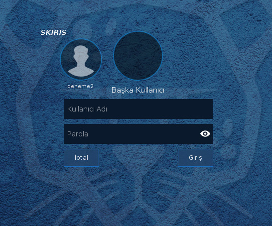
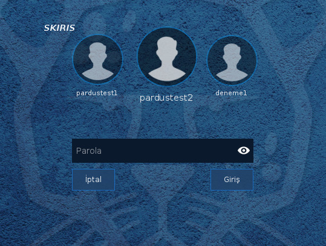
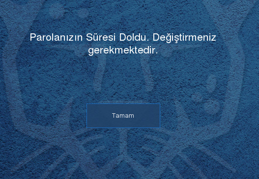
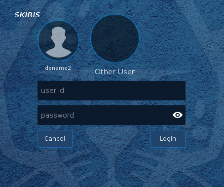
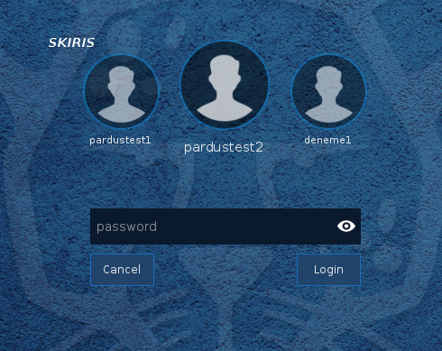
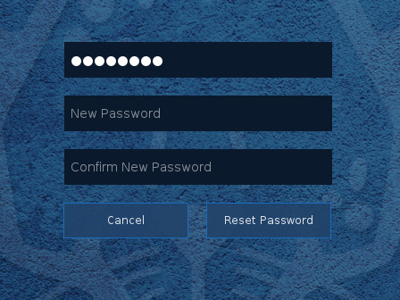

# hvl-lightdm-greeter 

# TURKISH

hvl-lightdm-greeter, lightdm yüklü sistemlerde kullanılabilecek bir giriş ekranı uygulamasıdır.  [qt-lightdm-greeter](https://github.com/surlykke/qt-lightdm-greeter) 'dan esinlenilerek c++ ve qt ile yazılmıştır.

Bu giriş ekranı, süresi dolmuş parolaları sıfırlama imkanı verebilmektedir (Windows aktif dizin hesapları ve yerel kullanıcı hesapları ile test edilmiştir). 
Eğer bir parolanın değiştirlmesi gerekiyorsa giriş sırasında kullanıcının parolasını sıfırlaması istenir. Arkasından parola sıfırlama sayfası açılarak kullanıcının parolasını sıfırlaması sağlanır.

Giriş ekranı Pardus 17.4 ve Xubuntu 18.04'de test edilmiştir.

`Giriş ekranı`


`Kullanıcı seçimi`


`Parola sıfırlama uyarısı`


`Parola sıfırlama Sayfası`


## Kurulum

Kodu derlemek için, cmake, gcc, qt5, lightdm, qtwebengine5-dev, qt5LinguistTools, qt5X11Extras-dev, libxcursor-dev paketlerinin sisteminizde kurulu olduğuna emin olun

Çalıştırmak için bağımlılıklar şunlardır: lightdm, libqt5webenginewidgets5, liblightdm-qt5-3-0, libqt5webengine5, libx11-6, libxcursor1, libqt5x11extras5

Kurlum için, aşağıdaki komutları çalıştırın:
    
git clone https://github.com/mertcelen/Hvl-Lightdm-Greeter.git
cd Hvl-Lightdm-Greeter
mkdir build
cd build
cmake ..
make 
sudo make install


## hvl-lightdm greeter'ı aktif hale getirmek için;

 `/etc/lightdm/lightdm.conf`, dosyası içinde, `SeatDefaults` bölümü altına aşağıdaki satırı ekleyin ya da başka bir değere atanmışsa güncelleyin:

    greeter-session=hvl-lightdm-greeter

Eğer böyle bir dosya mevcut değilse oluşturun.	
	
## Konfigürasyon

`/usr/share/lightdm/lightdm-hvl-greeter.conf.d/hvl-lightdm-greeter.conf` dosyası içinde kullanılabilecek çeşitli konfigürasyon seçenekleri bulunmaktadır. Örnek olarak: 
	-Arka plan resmi, 
	-Giriş, saat ve ayar formlarının pozisyonları, 
	-Beklenmesi gereken servisler vb..
Bu dosya içinde detaylı açıklamalar yapılmıştır. 


# ENGLISH

hvl-lightdm-greeter is a login application for the lightdm displaymanager, written in c++ and qt5. This project inspired by [qt-lightdm-greeter](https://github.com/surlykke/qt-lightdm-greeter) 

This greeter provides to reset expired passwords (Tested with Windows active directory accounts and local accounts). If a password expired. greeter opens password reset page and prompt user to reset password.

Tested on Pardus 17.4 and Xubuntu 18.04

`Login screen`


`Users screen`


`Prompt screen`


`Password reset screen`



## Installing

For building, make sure you have cmake, gcc, qt5, qtwebengine5-dev, qt5LinguistTools, qt5X11Extras-dev, libxcursor-dev installed on your system

For running, dependencies are : lightdm, libqt5webenginewidgets5, liblightdm-qt5-3-0, libqt5webengine5, libx11-6, libxcursor1, libqt5x11extras5

To install, do:
    
```shell
git clone https://github.com/mertcelen/Hvl-Lightdm-Greeter.git
cd Hvl-Lightdm-Greeter
mkdir build
cd build
cmake ..
make 
sudo make install
```

## How to enable hvl-lightdm greeter

Update or insert in(to) your `/etc/lightdm/lightdm.conf`, in the `SeatDefaults` section, this line:

    greeter-session=hvl-lightdm-greeter

If this file is not exist create new one.	
	
## Configururation

The file `/usr/share/lightdm/lightdm-hvl-greeter.conf.d/hvl-lightdm-greeter.conf` allows to configure hvl-lightdm-greeter. For example: 
	-background-image, 
	-positioning of loginform, settingsform and clockform. 
	-System services to wait etc.
The configuration options are documented in that file.


